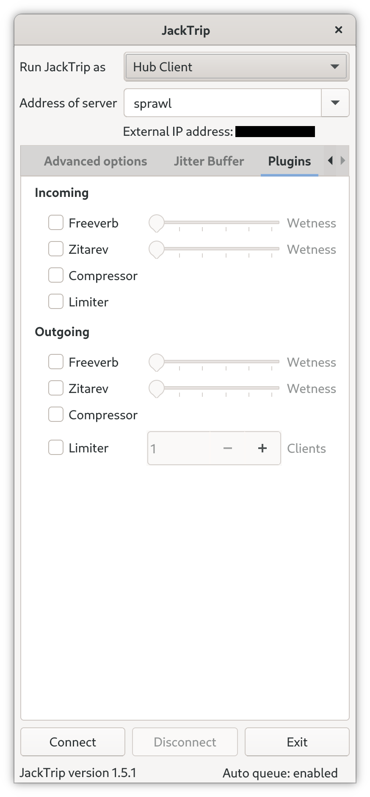

# Welcome to JackTrip

JackTrip is a Linux, macOS, or Windows multi-machine audio system used for network music performance over the Internet.
It supports any number of channels (as many as the computer/network can handle) of bidirectional, high quality, uncompressed audio signal streaming.

You can use it between any combination of machines e.g., one end using Linux can connect to another using macOS.

## Virtual Studio

With JackTrip Virtual Studio, you may sing with your chorus, or jam with your band, online without leaving home. With built-in support for live broadcasting, you can share your sessions on [JackTrip Radio](https://jacktrip.radio/). Additionally, Virtual Studio allows you to enhance your performances and bring your music to life utilizing Soundscapes digital signal processing. Musicians have creative control with dozens of audio effects with various reverbs, compression, attack and more, in real-time.

[See why thousands of musicians worldwide use JackTrip to rehearse together, perform together, collaborate together, and laugh together.](https://www.jacktrip.com/)

## Screenshots

=== "Virtual Studio"

    {width=450}

=== "Hubclient // Basic"

    {width=450}

=== "Hubclient // Plugins"

    {width=450}

=== "HubServer // Basic"

    {width=450}

=== "HubServer // Jitter Buffer"

    {width=450}

